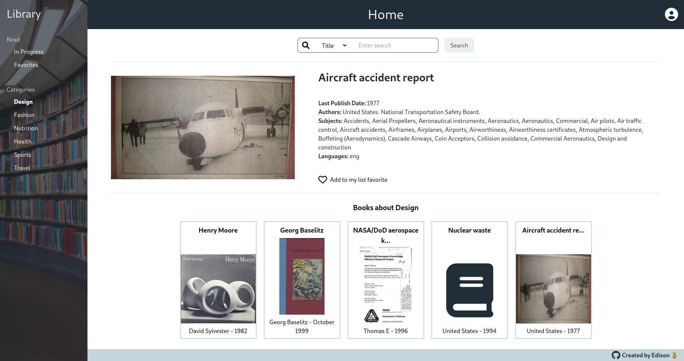

# Nuxtjs Library

Website that works as a library allowing users to search for books by title, author and subject. You can also save books
as favorites.

> This project is part of a code challenge. Instructions of challenge [here](./instructions.md).

## [See demo](https://nuxtjs-library.netlify.app/) &#x279c;



## Build Setup

```bash
# install dependencies
$ yarn install

# serve with hot reload at localhost:3000
$ yarn dev

# build for production and launch server
$ yarn build
$ yarn start

# generate static project
$ yarn generate
```
